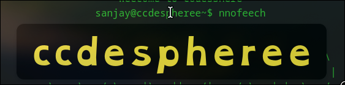

<div align="center">

<h1>🛡️ Guardian Reader</h1>
<p><strong>A lightweight accessibility companion for Firefox that enlarges, clarifies, and optionally speaks difficult words on any page.</strong></p>

<p><em>Designed to support readers with dyslexia, ADHD, low vision, or anyone who just needs a moment of focus.</em></p>

<!-- Hero screenshot -->
<p>
  
</p>
<sub>Options page showing activation methods, timing controls, themes, and font override.</sub>

</div>

---

## ✨ Key Features

| Feature | Description |
|---------|-------------|
| Popup Zoom | Enlarges the targeted word directly beneath the cursor with high clarity & dyslexia-friendly font. |
| Multiple Activation Modes | Hold Left / Middle / Right mouse button over a word, or optional Auto Hover (opt-in). |
| Follow Cursor | Popup smoothly follows while you keep holding or continue hovering. |
| Contrast Themes | Yellow on Black, Black on White, Sepia. |
| Dyslexia-Friendly Font | Ships with OpenDyslexic (embedded). |
| Text-to-Speech | Optional pronunciation via Web Speech API. |
| Adjustable Timing | Hold delay, zoom duration, and cooldown to prevent rapid re-triggers. |
| Persistent Preferences | Stored using `browser.storage.local`. |

---

## 🚀 Quick Start (Temporary Install)
1. Clone the repo:
   ```bash
   git clone https://github.com/sanjayrohith/dyslexic-extension.git
   cd dyslexic-extension
   ```
2. Open Firefox: `about:debugging#/runtime/this-firefox`.
3. Click “Load Temporary Add-on” → select `manifest.json`.
4. Visit any article, hold Middle Mouse (default) over a word until the popup appears.
5. Open the extension’s options to tweak activation method, hold delay, theme, and more.

---

## 🛠 Activation Modes
| Mode | How It Works | Use Case |
|------|--------------|----------|
| Left / Middle / Right Hold | Press & hold chosen button over a word for the configured hold delay. | Precise, intentional activation. |
| Auto (Hover) | Hover steadily over a word for the hold delay. | Hands-free exploration, low-effort reading. |

Hold delay and cooldown help prevent accidental triggers.

---

## 🎨 Visual & Readability Enhancements
- OpenDyslexic enforced for popup text (local font load + fallback).
- High-contrast background styles.
- Smooth scale/opacity animation; popup follows cursor while active.
- Planned (optional): syllable hints, phonetic support, reduced-motion mode.

---

## 🔊 Text-to-Speech
Triggered if TTS is enabled or if the response mode includes it. Uses `speechSynthesis` (availability and voices depend on OS / Firefox build).

---

## ⚙️ Configuration Reference
| Setting | Description |
|---------|-------------|
| Sensitivity | (Reserved for future heuristics). |
| Response Mode | Visual only, visual + background, or include TTS. |
| Zoom Scale / Duration | Size and lifespan of the popup. |
| Cooldown | Minimum ms between triggers on the same word. |
| Activation Method | left / middle / right / auto (hover). |
| Hold Delay | Time pointer must remain on word before popup shows. |
| Theme | Contrast color scheme. |
| Font Override | Enforce OpenDyslexic or revert to page font. |

---

## 📁 Project Structure
```
manifest.json        # Firefox manifest (MV2)
background.js        # Settings + TTS broker
content.js           # Activation logic, overlay rendering, cursor follow
options.html/js      # Options UI & persistence
style.css            # Overlay + font definitions
fonts/               # Local OpenDyslexic font assets
icons/               # Extension icons (48/96px)
docs/                # Screenshots and docs (e.g., screenshot-options.png)
```

---

## 🔄 Roadmap
- Progress ring while holding
- Adaptive placement (flip above if near bottom edge)
- Multi-word expansion
- Voice/rate/pitch controls for TTS
- Export/import settings
- MV3 migration

---

## 🔐 Privacy
All processing is local. No analytics or external data collection. The bundled OpenDyslexic font is licensed under the SIL Open Font License.

---

## 🤝 Contributing
- Fork and branch (`feat/your-idea`)
- Keep changes accessible, documented, and scoped
- Open a PR with UX rationale

---

## 📄 License
Source: MIT. OpenDyslexic font: SIL Open Font License.

<sub>Made to reduce friction between readers and words.</sub>
